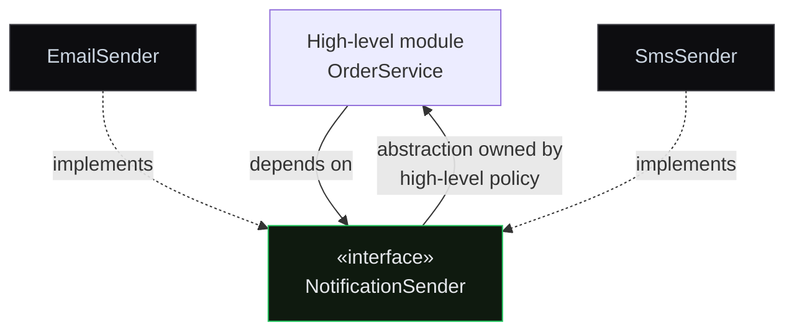

## Title
SOLID Principles

## Summary
SOLID — five OO design principles: **S** Single Responsibility, **O** Open-Closed, **L** Liskov Substitution, **I** Interface Segregation, **D** Dependency Inversion. Not laws but heuristics for maintainable, testable, extensible code. Common mid/senior interview material.

## TL;DR
SOLID is five heuristics — S, O, L, I, D — that keep object-oriented code change-tolerant and testable.

## Analogy
Think of it like a well-organised kitchen: each station has one job (SRP), you can swap the blender for a better model without rebuilding the countertop (OCP/DIP), a sous chef can stand in for the head chef without the dish falling apart (LSP), and every cook receives only the tools their station actually needs — no unused gadgets cluttering the workspace (ISP).

## What & Why
Without SOLID, even small requirement changes trigger ripple edits across unrelated files. A schema change breaks PDF code because one class does too much (SRP). A new `Shape` type forces edits to every type-switch (OCP). A subclass silently violates the caller's invariants (Liskov Substitution). A fat interface forces a `Robot` to implement `eat()` (Interface Segregation). A hard-wired `new EmailSender()` inside `OrderService` makes it impossible to unit-test (Dependency Inversion). Each principle contains one category of that blast radius, turning brittle monolithic code into composable, swappable, testable modules.

## How It Works
**SRP** carves a class at its single axis of change: `ReportService` → `ReportRepository` (data access), `ReportCalculator` (business logic), `PdfFormatter` (presentation). Each is testable in isolation; a schema change touches only the repository.

**OCP** delegates new behaviour to new types. A new `Shape` is a new class implementing `Shape.area()` — the dispatcher is never touched. The `instanceof` chain is the telltale OCP violation.

**LSP** enforces behavioural contracts, not just structural IS-A. `Square extends Rectangle` violates the Rectangle contract that `setW` and `setH` are independent — after `setW(5); setH(3)` on a Square, area is still 9. Fix: parallel classes under a shared `Shape` interface.

**Interface Segregation** keeps each interface to what clients actually call. A `Robot` should not implement `eat()`. Split the fat `Worker` into `Workable`, `Feedable`, `Sleepable`.

**Dependency Inversion** flips the dependency arrow. `OrderService` receives a `NotificationSender` abstraction through its constructor — `EmailSender` or `SmsSender` is injected from outside. The abstraction is owned by the high-level policy (see diagram). DIP is the theoretical core of every DI framework, including Spring.

## Gotcha
SOLID over-applied causes class explosion and speculative abstraction. Each additional abstraction layer adds cognitive load and debugging indirection — pay for it only where real change pressure exists: module boundaries and integration points. Premature SRP splits and rigid OCP enforcement on stable code are YAGNI violations.

## Recap
- **S** — one reason to change.
- **O** — extend, don't modify.
- **L** — subtypes honour the parent's full contract.
- **I** — clients depend only on what they call.
- **D** — depend on abstractions, inject the details.

Apply where change is expected.

## Deep Dive
## S — Single Responsibility Principle

**A class should have one reason to change.**

Not "one method" but **one axis of change**.

**Violation**: `ReportService` fetches from DB, applies business rules, generates PDF. Three reasons to change → three SRP risks.

**Fix**:
- `ReportRepository` — data access.
- `ReportCalculator` — business logic.
- `PdfFormatter` — presentation.

Each class is testable in isolation. Schema change doesn't touch PDF code.

## O — Open-Closed Principle

**Open for extension, closed for modification.**

New behaviour is added through **new implementations of an abstraction**, not by editing existing code. The tool is polymorphism.

**Violation**: an `if-else` chain keyed by type.

```java
double area(Shape s) {
    if (s instanceof Circle)    return Math.PI * ((Circle)s).r * ...;
    if (s instanceof Rectangle) return ((Rectangle)s).w * ((Rectangle)s).h;
    // every new Shape requires editing this method
}
```

**Fix** — Strategy pattern / virtual dispatch:

```java
interface Shape { double area(); }
class Circle implements Shape { public double area() { ... } }
class Rectangle implements Shape { public double area() { ... } }
// A new shape? A new class. Existing code is untouched.
```

## L — Liskov Substitution Principle

**A subtype must be substitutable for its base type without breaking correctness.**

Not just structural IS-A but **behavioural**: the subclass must honour the parent's preconditions, postconditions, and invariants.

**The canonical violation — Square extends Rectangle**:

```java
class Rectangle { int w, h; void setW(int w) { this.w = w; } void setH(int h) { this.h = h; } }
class Square extends Rectangle { void setW(int w) { this.w = w; this.h = w; } ... }

void test(Rectangle r) { r.setW(5); r.setH(3); assert r.w * r.h == 15; }
test(new Square());  // FAIL: w=h=3, area == 9
```

Code relying on `setW` and `setH` being independent (a natural Rectangle assumption) breaks when a Square is substituted.

**Fix**: Rectangle and Square are parallel classes sharing a `Shape` interface. Or make Rectangle immutable (`withWidth(...)` instead of `setW(...)`).

## I — Interface Segregation Principle

**Clients should not depend on methods they don't use.**

Fat interfaces force clients to implement irrelevant methods (often via `UnsupportedOperationException`) and make mocks bloated.

**Violation**:
```java
interface Worker {
    void work();
    void eat();
    void sleep();
}
class Robot implements Worker {
    public void work() { ... }
    public void eat() { throw new UnsupportedOperationException(); }
    public void sleep() { throw new UnsupportedOperationException(); }
}
```

**Fix**:
```java
interface Workable { void work(); }
interface Feedable { void eat(); }
interface Sleepable { void sleep(); }

class Human implements Workable, Feedable, Sleepable { ... }
class Robot implements Workable { ... }
```

## D — Dependency Inversion Principle

**High-level modules must not depend on low-level modules. Both depend on abstractions.** Abstractions don't depend on details; details depend on abstractions.

**Violation**: `OrderService` directly `new EmailSender()`.

**Fix**: introduce an interface, inject the implementation via the constructor.

```java
interface NotificationSender { void send(String to, String msg); }
class EmailSender implements NotificationSender { ... }
class SmsSender implements NotificationSender { ... }

class OrderService {
    private final NotificationSender sender;
    public OrderService(NotificationSender sender) { this.sender = sender; }
}
```

`OrderService` depends on the interface. Any implementation can be substituted — Spring does it automatically via DI. DIP is the **theoretical foundation** of DI frameworks.

## Pragmatism

> [!production]
> SOLID is **heuristics, not laws**. Over-applying SRP → class explosion. Rigid OCP → just-in-case abstractions (YAGNI violation). Apply SOLID where **change is expected**: module boundaries, integration points. Inside a small service, pragmatic design can tolerate fewer abstractions.

**SOLID-violation symptoms** = "design smells":
- A change ripples across many files → SRP or OCP violated.
- `instanceof` chains → OCP.
- Subclass fails the parent's test → LSP.
- `throw new UnsupportedOperationException()` in implementations → ISP.
- A class `new`s its dependencies → DIP (can't mock → can't test).

## Diagram


## Code
```java
// --- DIP + OCP example ---

public interface NotificationSender {
    void send(String to, String message);
}

public class EmailSender implements NotificationSender {
    @Override public void send(String to, String message) {
        System.out.println("Email to " + to + ": " + message);
    }
}

public class SmsSender implements NotificationSender {
    @Override public void send(String to, String message) {
        System.out.println("SMS to " + to + ": " + message);
    }
}

public class OrderService {
    private final NotificationSender sender;

    public OrderService(NotificationSender sender) {
        this.sender = sender;
    }

    public void placeOrder(String customerContact, String item) {
        sender.send(customerContact, "Your order for " + item + " is confirmed!");
    }

    public static void main(String[] args) {
        OrderService emailOrders = new OrderService(new EmailSender());
        emailOrders.placeOrder("alice@mail.com", "Laptop");

        OrderService smsOrders = new OrderService(new SmsSender());
        smsOrders.placeOrder("+1234567890", "Phone");
    }
}
```

## Tip
When asked about SOLID, don't recite definitions — give a **before/after** code example for at least one principle. A concrete refactoring shows you apply the principles in practice, not just know them from a textbook.

## Spring
### concept
SOLID Principles

### springFeature
Spring Dependency Injection

### explanation
Spring is **DIP as a framework**. High-level business logic depends on interfaces; the Spring IoC container injects concrete implementations at runtime.

- `@Autowired`, `@Qualifier`, `@Primary` — DIP tooling.
- `@Profile` — OCP in action: different implementations for different environments (dev/prod).
- `@Conditional` — pick an implementation based on conditions, no consumer edits.

Understanding SOLID is understanding **why** Spring was designed this way. Without DIP/OCP in mind, the framework looks like magic; with them, it's an obvious realisation of the principles.

## Interview
### [3-7-q0 | junior] Explain the Single Responsibility Principle with an example of a violation and how to fix it.
SRP: a class should have **one reason to change**.

**Violation**: `ReportService` does it all — DB fetch, business rules, PDF generation. Three reasons to change → hard to test, a schema change touches PDF code.

**Fix**: split into three classes, each with one axis of change:
- `ReportRepository` — data access.
- `ReportCalculator` — business logic.
- `PdfFormatter` — presentation.

Each is testable in isolation and changes independently. Dependency injection wires them together.

### [3-7-q1 | mid] How does LSP differ from simple IS-A inheritance? Give a classic violation.
IS-A is **structural** (Dog IS-A Animal). LSP is **behavioural**: the subclass must honour the parent's contract (preconditions, postconditions, invariants, exceptions).

**Canonical violation — Square extends Rectangle**:

Rectangle's contract allows independent width/height changes. Square couples them (`setW` changes both `w` and `h`). Code assuming independence:

```java
void test(Rectangle r) {
    r.setW(5); r.setH(3);
    assert r.area() == 15;
}
test(new Square());  // FAIL: w = h = 3, area = 9
```

**Fix**: Rectangle and Square as parallel `implements Shape` classes, **not** inheritance. Or make Rectangle immutable (`withWidth(...)` returns a new Rectangle).

LSP is the strictest SOLID principle. Violations often hide in setters and mutability: to honour LSP, a subclass cannot **strengthen** the parent's preconditions and cannot **weaken** its postconditions.

### [3-7-q2 | senior] In a large microservices codebase, how do you balance SOLID against performance and complexity?
SOLID is **guidance, not law**. Blind application leads to:
- **Class explosion** from over-applied SRP — hard to debug, hard to read.
- **Speculative abstractions** from rigid OCP — layers that "might be useful someday" violate YAGNI.
- **Performance penalty** — virtual dispatch through an interface is slower than a direct call, especially in tight loops (JIT optimises it but not always).

**Practical rules**:
- In microservices, each service is already an SRP/DIP boundary — inside a small service, fewer abstractions are acceptable.
- Interfaces at **module boundaries**, not between every class.
- Refactor **toward** SOLID once real change pressure appears — not "just in case".
- A performance-critical path may intentionally violate DIP (direct calls) — but with benchmarks in hand.

**Senior skill**: knowing when a principle's cost outweighs its benefit. Abstraction costs cognitive load + indirection — pay for it only in proportion to the future change it saves.

## Checkpoint
### [3-7-cp0] Which SOLID principle does an `instanceof` chain in a type-switch dispatcher violate, and how is it fixed?
The **Open-Closed Principle** — the dispatcher must be edited each time a new type is added. The fix is to push the behaviour into the type via an interface method (e.g., `area()`) so callers are closed for modification and new types appear as new classes.

### [3-7-cp1] Why is `Square extends Rectangle` an LSP violation even though a square is geometrically a rectangle?
LSP requires **behavioural** substitutability, not just structural IS-A. `Rectangle`'s contract allows independent `setW` / `setH`. `Square` tightens that precondition by coupling both dimensions — code asserting `r.setW(5); r.setH(3); assert area == 15` fails silently when a Square is passed. The geometric truth is irrelevant; the contract is what counts.

## Key Terms
### Liskov Substitution
A subtype must be substitutable for its base type without breaking callers. Subclasses must not strengthen preconditions or weaken postconditions, and must not violate invariants the parent's callers rely on.

### Dependency Inversion
High-level modules must not depend on low-level modules; both must depend on abstractions. Abstractions must not depend on details; details depend on abstractions. This is the theoretical foundation of dependency injection frameworks such as Spring.

### Interface Segregation
Clients should not be forced to depend on interface methods they do not use. Prefer many narrow, role-specific interfaces over one large general-purpose interface so each class depends only on the subset of operations it actually calls.
