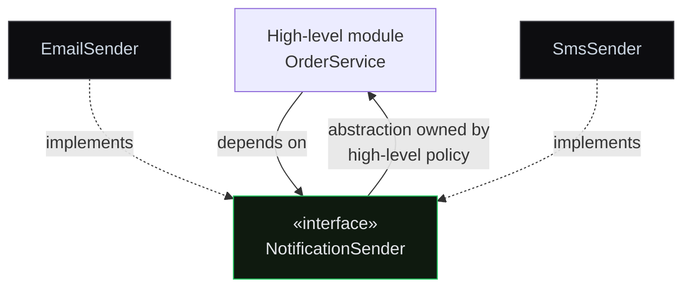

## Title
SOLID Principles

## Summary
SOLID — пять принципов ООП-дизайна: **S** Single Responsibility, **O** Open-Closed, **L** Liskov Substitution, **I** Interface Segregation, **D** Dependency Inversion. Это не законы, а эвристики для поддерживаемого, тестируемого и расширяемого кода. Частый материал для mid/senior интервью.

## TL;DR
SOLID — пять эвристик (S, O, L, I, D), которые делают объектно-ориентированный код устойчивым к изменениям и удобным для тестирования.

## Analogy
Представьте хорошо организованную кухню: у каждой станции своя задача (SRP), блендер можно заменить новой моделью без переделки столешницы (OCP/DIP), су-шеф может подменить шеф-повара, не испортив блюдо (LSP), и каждый повар получает только инструменты своей станции — никаких лишних гаджетов на рабочем месте (ISP).

## What & Why
Без SOLID даже небольшие требования вызывают цепную реакцию правок. Изменение схемы БД ломает PDF-код — один класс делает слишком много (SRP). Новый тип `Shape` требует правки всех type-switch (OCP). Подкласс молча нарушает инварианты вызывающего кода (Liskov Substitution). Жирный интерфейс заставляет `Robot` реализовывать `eat()` (Interface Segregation). Жёстко вшитый `new EmailSender()` внутри `OrderService` делает его невозможным для unit-тестирования (Dependency Inversion). Каждый принцип ограничивает одну из этих категорий проблем, превращая хрупкий монолитный код в компонуемые, взаимозаменяемые и тестируемые модули.

## How It Works
**SRP** делит класс по единственной оси изменений: `ReportService` → `ReportRepository` (доступ к данным), `ReportCalculator` (бизнес-логика), `PdfFormatter` (представление). Каждый тестируется в изоляции; изменение схемы затрагивает только репозиторий.

**OCP** делегирует новое поведение новым типам. Новый `Shape` — это новый класс с реализацией `Shape.area()`; диспетчер не трогается. Цепочка `instanceof` — классический признак нарушения OCP.

**LSP** требует поведенческих гарантий, а не только структурного IS-A. `Square extends Rectangle` нарушает контракт Rectangle о независимости `setW` и `setH` — после `setW(5); setH(3)` на Square площадь по-прежнему равна 9. Решение: параллельные классы с общим интерфейсом `Shape`.

**Interface Segregation** ограничивает каждый интерфейс тем, что клиенты реально вызывают. `Robot` не должен реализовывать `eat()`. Разбейте жирный `Worker` на `Workable`, `Feedable`, `Sleepable`.

**Dependency Inversion** разворачивает стрелку зависимости. `OrderService` получает абстракцию `NotificationSender` через конструктор — `EmailSender` или `SmsSender` инжектится снаружи. Абстракция принадлежит политике высокого уровня (см. диаграмму). DIP — теоретический фундамент любого DI-фреймворка, включая Spring.

## Gotcha
Чрезмерное применение SOLID приводит к взрыву классов и спекулятивным абстракциям. Каждый дополнительный уровень абстракции добавляет cognitive load и затрудняет отладку — платите за него только там, где реально ожидается изменение: границы модулей и точки интеграции. Преждевременное разбиение по SRP и жёсткий OCP для стабильного кода нарушают YAGNI.

## Recap
- **S** — одна причина для изменения.
- **O** — расширяй, не модифицируй.
- **L** — подтипы соблюдают полный контракт родителя.
- **I** — клиенты зависят только от того, что вызывают.
- **D** — зависеть от абстракций, инжектировать детали.

Применяйте там, где ожидается изменение.

## Deep Dive
## S — Single Responsibility Principle

**У класса должна быть одна причина для изменения.**

Не «один метод», а **одна ось изменения**.

**Нарушение**: `ReportService` делает fetch из БД, применяет бизнес-правила, генерирует PDF. Три причины для изменения → три SRP-риска.

**Исправление**:
- `ReportRepository` — data access.
- `ReportCalculator` — бизнес-логика.
- `PdfFormatter` — представление.

Каждый класс можно тестировать изолированно. Изменение схемы БД не трогает PDF-код.

## O — Open-Closed Principle

**Открыт для расширения, закрыт для изменения.**

Новое поведение добавляется через **новые реализации абстракции**, а не правкой существующего кода. Инструмент — полиморфизм.

**Нарушение**: `if-else`-цепочка по типу.

```java
double area(Shape s) {
    if (s instanceof Circle)    return Math.PI * ((Circle)s).r * ...;
    if (s instanceof Rectangle) return ((Rectangle)s).w * ((Rectangle)s).h;
    // каждый новый Shape требует правки метода
}
```

**Исправление** — паттерн Strategy / виртуальная диспетчеризация:

```java
interface Shape { double area(); }
class Circle implements Shape { public double area() { ... } }
class Rectangle implements Shape { public double area() { ... } }
// Новая фигура? Новый класс. Существующий код не трогается.
```

## L — Liskov Substitution Principle

**Подтип должен быть взаимозаменяем с базовым типом без нарушения корректности.**

Не просто структурное IS-A, а **поведенческое**: подкласс должен соблюдать preconditions, postconditions и инварианты родителя.

**Классическое нарушение — Square extends Rectangle**:

```java
class Rectangle { int w, h; void setW(int w) { this.w = w; } void setH(int h) { this.h = h; } }
class Square extends Rectangle { void setW(int w) { this.w = w; this.h = w; } ... }

void test(Rectangle r) { r.setW(5); r.setH(3); assert r.w * r.h == 15; }
test(new Square());  // FAIL: w=h=3, area == 9
```

Код, полагающийся на независимость `setW` и `setH` (естественное предположение для Rectangle), ломается при подстановке Square.

**Исправление**: Rectangle и Square — параллельные классы с общим интерфейсом `Shape`. Либо сделайте Rectangle immutable (`withWidth(...)` вместо `setW(...)`).

## I — Interface Segregation Principle

**Клиенты не должны зависеть от методов, которые они не используют.**

Fat-интерфейсы заставляют клиентов реализовывать ненужные методы (часто через `UnsupportedOperationException`) и делают моки громоздкими.

**Нарушение**:
```java
interface Worker {
    void work();
    void eat();
    void sleep();
}
class Robot implements Worker {
    public void work() { ... }
    public void eat() { throw new UnsupportedOperationException(); }
    public void sleep() { throw new UnsupportedOperationException(); }
}
```

**Исправление**:
```java
interface Workable { void work(); }
interface Feedable { void eat(); }
interface Sleepable { void sleep(); }

class Human implements Workable, Feedable, Sleepable { ... }
class Robot implements Workable { ... }
```

## D — Dependency Inversion Principle

**Модули верхнего уровня не зависят от модулей нижнего уровня. Оба зависят от абстракций.** Абстракции не зависят от деталей, детали — от абстракций.

**Нарушение**: `OrderService` напрямую `new EmailSender()`.

**Исправление**: вводим интерфейс, инжектим реализацию через конструктор.

```java
interface NotificationSender { void send(String to, String msg); }
class EmailSender implements NotificationSender { ... }
class SmsSender implements NotificationSender { ... }

class OrderService {
    private final NotificationSender sender;
    public OrderService(NotificationSender sender) { this.sender = sender; }
}
```

`OrderService` зависит от интерфейса. Можно подставить любую реализацию — Spring делает это автоматически через DI. DIP — **теоретический фундамент** DI-фреймворков.

## Прагматизм

> [!production]
> SOLID — **эвристики, не законы**. Переприменение SRP → взрыв классов. Жёсткий OCP → абстракции «на всякий случай» (нарушение YAGNI). Применяйте SOLID там, где **ожидается изменение**: границы модулей, точки интеграции. Внутри небольшого сервиса прагматичный дизайн может терпеть меньше абстракций.

**Симптомы нарушения SOLID** = «design smells»:
- Изменение рассыпается по многим файлам → нарушена SRP или OCP.
- `instanceof`-цепочки → OCP.
- Подкласс падает тест родителя → LSP.
- `throw new UnsupportedOperationException()` в реализации → ISP.
- Класс `new`-ает свои зависимости → DIP (нельзя замокать → нельзя протестировать).

## Diagram


## Code
```java
// --- DIP + OCP example ---

public interface NotificationSender {
    void send(String to, String message);
}

public class EmailSender implements NotificationSender {
    @Override public void send(String to, String message) {
        System.out.println("Email to " + to + ": " + message);
    }
}

public class SmsSender implements NotificationSender {
    @Override public void send(String to, String message) {
        System.out.println("SMS to " + to + ": " + message);
    }
}

public class OrderService {
    private final NotificationSender sender;

    public OrderService(NotificationSender sender) {
        this.sender = sender;
    }

    public void placeOrder(String customerContact, String item) {
        sender.send(customerContact, "Your order for " + item + " is confirmed!");
    }

    public static void main(String[] args) {
        OrderService emailOrders = new OrderService(new EmailSender());
        emailOrders.placeOrder("alice@mail.com", "Laptop");

        OrderService smsOrders = new OrderService(new SmsSender());
        smsOrders.placeOrder("+1234567890", "Phone");
    }
}
```

## Tip
На интервью по SOLID не зачитывайте определения — дайте **before/after** пример кода хотя бы для одного принципа. Конкретный рефакторинг показывает, что вы применяете принципы в практике, а не только знаете их по учебнику.

## Spring
### concept
SOLID Principles

### springFeature
Spring Dependency Injection

### explanation
Spring — это **DIP как фреймворк**. Высокоуровневая бизнес-логика зависит от интерфейсов; Spring IoC-контейнер инжектит конкретные реализации в рантайме.

- `@Autowired`, `@Qualifier`, `@Primary` — инструменты DIP.
- `@Profile` — OCP в действии: разные реализации для разных окружений (dev/prod).
- `@Conditional` — выбор реализации по условиям без правки консьюмеров.

Понимание SOLID — это понимание, **почему** Spring устроен так, как устроен. Без DIP/OCP в голове фреймворк кажется магией; с ними — очевидной реализацией принципов.

## Interview
### [3-7-q0 | junior] Объясните Single Responsibility Principle на примере нарушения и его исправления.
SRP: у класса должна быть **одна причина для изменения**.

**Нарушение**: `ReportService` делает всё сразу — fetch из БД, применение бизнес-правил, генерация PDF. Три причины для изменения → тестирование сложное, изменение схемы БД трогает PDF-код.

**Исправление**: разделить на три класса, каждый с одной осью изменений:
- `ReportRepository` — data access.
- `ReportCalculator` — бизнес-логика.
- `PdfFormatter` — представление.

Каждый можно тестировать в изоляции и менять независимо. Инъекция зависимостей связывает их вместе.

### [3-7-q1 | mid] Чем LSP отличается от простого IS-A? Приведите классическое нарушение.
IS-A — **структурное** (Dog IS-A Animal). LSP — **поведенческое**: подкласс обязан соблюдать контракт родителя (preconditions, postconditions, инварианты, исключения).

**Классическое нарушение — Square extends Rectangle**:

Контракт Rectangle позволяет независимо менять width и height. Square связывает их (`setW` меняет и `w`, и `h`). Код, зависящий от независимости:

```java
void test(Rectangle r) {
    r.setW(5); r.setH(3);
    assert r.area() == 15;
}
test(new Square());  // FAIL: w = h = 3, area = 9
```

**Исправление**: Rectangle и Square — параллельные классы `implements Shape`, **не** наследование. Либо сделать Rectangle immutable (`withWidth(...)` возвращает новый Rectangle).

LSP — самый строгий из SOLID. Нарушения часто скрываются в сеттерах и мутабельности: чтобы соблюсти LSP, подкласс не может **усилить** precondition и не может **ослабить** postcondition родителя.

### [3-7-q2 | senior] Как балансировать SOLID с производительностью и сложностью кода в больших микросервисах?
SOLID — **руководства, не законы**. Слепое применение приводит к:
- **Взрыву классов** от переприменённого SRP — сложно отлаживать, сложно читать.
- **Спекулятивным абстракциям** от жёсткого OCP — слои, которые «когда-нибудь пригодятся», нарушают YAGNI.
- **Performance penalty** — virtual dispatch через интерфейс медленнее прямого вызова, особенно в tight loops (JIT это оптимизирует, но не всегда).

**Практические правила**:
- В микросервисах каждый сервис уже граница SRP/DIP — внутри маленького сервиса меньше абстракций приемлемо.
- Интерфейсы на **границах модулей**, не между каждыми классами.
- Refactor **toward** SOLID, когда давление изменений реально возникло — не «на всякий случай».
- Performance-critical path может намеренно нарушать DIP (прямые вызовы) — но с бенчмарками на руках.

**Senior-навык**: понимать, когда цена принципа превышает выгоду. Абстракция стоит cognitive load + индирекции — платите за неё ровно столько, сколько она экономит на будущих изменениях.

## Checkpoint
### [3-7-cp0] Какой принцип SOLID нарушает цепочка `instanceof` в диспетчере по типу, и как это исправить?
**Open-Closed Principle** — диспетчер нужно редактировать каждый раз при добавлении нового типа. Решение: перенести поведение в тип через метод интерфейса (например, `area()`), чтобы вызывающий код был закрыт для модификации, а новые типы добавлялись как новые классы.

### [3-7-cp1] Почему `Square extends Rectangle` — нарушение LSP, если геометрически квадрат является прямоугольником?
LSP требует **поведенческой** взаимозаменяемости, а не только структурного IS-A. Контракт `Rectangle` подразумевает независимость `setW` и `setH`. `Square` ужесточает это предусловие, связывая оба измерения — код с утверждением `r.setW(5); r.setH(3); assert area == 15` молча падает при передаче Square. Геометрическая истина не имеет значения; важен контракт.

## Key Terms
### Liskov Substitution
Подтип должен быть взаимозаменяем с базовым типом без нарушения корректности вызывающего кода. Подклассы не должны усиливать preconditions и ослаблять postconditions, а также нарушать инварианты, на которые полагаются вызывающие стороны.

### Dependency Inversion
Модули верхнего уровня не должны зависеть от модулей нижнего уровня; оба должны зависеть от абстракций. Абстракции не зависят от деталей; детали зависят от абстракций. Это теоретический фундамент фреймворков инъекции зависимостей, таких как Spring.

### Interface Segregation
Клиенты не должны быть вынуждены зависеть от методов интерфейса, которые они не используют. Предпочтительнее много узких, ролевых интерфейсов вместо одного большого универсального, чтобы каждый класс зависел только от того подмножества операций, которое он реально вызывает.
