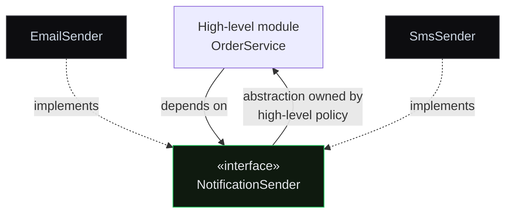

# DevCore Learning UX — Plan B2 (Mermaid + in-body key terms + exemplars) Implementation Plan

> **For agentic workers:** REQUIRED SUB-SKILL: Use superpowers:subagent-driven-development (recommended) or superpowers:executing-plans to implement this plan task-by-task. Steps use checkbox (`- [ ]`) syntax for tracking.

**Goal:** Complete the Learning UX phase by adding the Mermaid diagram path, in-markdown-body key-term underlining, resolving the Deep-depth mini-quiz/interview overlap, and authoring the 5 flagship exemplar topics.

**Architecture:** Extends the already-merged Content Engine + Learning UX B1. B1 landed `resolveTopic`, `useDepth`, `LessonView`, and all `lesson/` components including per-field `KeyTermText`, `Checkpoint`, `MiniQuiz`, and `Glossary`. B2 adds only the four remaining pieces from the design spec (§7 diagrams, §8 in-body key terms, the mini-quiz overlap question, and §9's exemplar authoring). The Mermaid source is threaded as a new **additive** `diagramSrc` field through the existing note→norm→emit pipeline; the UI reads a `DiagramRef` union from `resolveTopic`. The heavy `mermaid` library is code-split via an in-component `import("mermaid")` so it never enters the main bundle.

**Tech Stack:** Next.js 16 (non-standard — see Global Constraints), React, TypeScript, `react-markdown` + `remark-gfm`, `gray-matter`, Vitest, `tsx`, Tailwind, `mermaid` (new dep).

## Global Constraints

- **Next.js 16 is non-standard.** Per `AGENTS.md`: read the relevant guide in `node_modules/next/dist/docs/` before any routing/layout change. This plan touches no routing; no new `next/dynamic` or server/client boundary is introduced (Mermaid is loaded via a plain `import("mermaid")` inside an existing `"use client"` component).
- **Content is generated & git-ignored.** `src/data/content/*.ts` is produced by `npm run compile-content` (auto-run via `predev`/`prebuild`/`pretest`). Never hand-edit it. Author `content/` notes only.
- **Bilingual parity is build-enforced.** Every note has an EN file and a `ru/` mirror. Any **present** optional field must exist in BOTH languages for a `published` note, or `validateTopic` errors. Prose uses the project `\n---\n` convention via `localized()`; the engine stores prose as `Loc { ru, en }`.
- **Additive-only to the content model.** The 106-topic round-trip guard (`scripts/roundtrip.test.ts`) compares ONLY `ORIGINAL_KEYS` (`id, blockId, diagram, title, summary, deepDive, tip, code, interviewQs, spring`). New fields must stay outside that set. `diagramSrc` is additive and MUST NOT be added to `ORIGINAL_KEYS`.
- **Calm typography-led visual language** (design §3): boxed elements are ONLY the code block and the single Gotcha. Accent green for structure/interactive; amber only for gotcha. The Mermaid container is a neutral bordered panel (matches the code block frame), not a colored card.
- **Commands:** tests `npm test` (Vitest, runs `compile-content` first via `pretest`); a single file `npx vitest run <path>`; typecheck `npm run typecheck`; build `npm run build`; regenerate content `npm run compile-content`.

---

## File Structure

**Engine (modify):**
- `src/lib/types.ts` — add `diagramSrc?: string` to `TopicContent`.
- `scripts/lib/norm.ts` — add `diagramSrc?` to `NormTopic`; thread through `decompose`/`recompose`.
- `scripts/lib/note.ts` — add `"diagram"` to `RESERVED`; serialize/parse the `## Diagram` ```mermaid block.
- `scripts/lib/validate.ts` — coherence check: `diagram: mermaid` ⟺ `diagramSrc` present.

**App (modify):**
- `src/lib/resolve-topic.ts` — add `DiagramRef` union; `ResolvedTopic.diagram` becomes `DiagramRef | undefined`.
- `src/components/Diagram.tsx` — accept a `DiagramRef` prop; render React registry OR `MermaidDiagram`.
- `src/components/LessonView.tsx` — new `Diagram` prop shape; pass `keyTerms`/`locale` into the two prose `Markdown` calls; drop `MiniQuiz` when the interview layer is visible; point the completion nudge at whichever recall element shows.
- `src/components/Markdown.tsx` — optional `keyTerms`/`locale` props; underline first occurrence of each term in `p`/`li` text nodes, never in code.
- `src/lib/lesson-layers.ts` — add pure `showMiniQuiz(depth)` helper.

**App (create):**
- `src/components/lesson/MermaidDiagram.tsx` — client component, lazy-loads `mermaid` and renders SVG.

**Content (create/rewrite — status `published`):**
- `content/java-core/03-oop/3-7.md` + `ru/3-7.md` — SOLID, gets the first **Mermaid** diagram.
- `content/java-core/01-how-java-works/1-1.md` + `ru/1-1.md` — JVM (reuses `jvm-architecture` React diagram).
- `content/java-core/.../6-2.md` + ru — HashMap (reuses `hashmap-internals`).
- `content/java-core/.../8-1.md` + ru — Threads (reuses `thread-lifecycle`).
- `content/java-core/.../7-4.md` + ru — Streams (reuses `stream-pipeline`).

**Dependency:** add `mermaid` to `dependencies`.

---

### Task 1: Thread `diagramSrc` through the content engine

Adds a language-neutral Mermaid source to the pipeline as an additive field, mirroring how `code` is handled (stored once, emitted into both note bodies, parsed from the EN side).

**Files:**
- Modify: `src/lib/types.ts:11-12`
- Modify: `scripts/lib/norm.ts:9-28`, `:33-66`, `:68-102`
- Modify: `scripts/lib/note.ts:9-12`, `:150-181`, `:189-219`
- Modify: `scripts/lib/validate.ts:29-35`
- Test: `scripts/lib/note.test.ts`, `scripts/lib/validate.test.ts`

**Interfaces:**
- Produces: `TopicContent.diagramSrc?: string`; `NormTopic.diagramSrc?: string`. `note.ts` serializes `n.diagramSrc` as a `## Diagram\n```mermaid\n…\n``` ` section and parses it back via the existing `unfence()`. `validateTopic` errors when `diagram === "mermaid"` and `diagramSrc` is blank.
- Consumes: existing `unfence()` (`scripts/lib/note.ts:39`), `fence` pattern, and the `RESERVED`/`sectionize` machinery.

- [ ] **Step 1: Guard — confirm no existing note body uses `## Diagram`**

Adding `"diagram"` to `RESERVED` would reinterpret any `## Diagram` heading currently living inside a `deepDive`/prose block as a section boundary. Verify there are none.

Run: `grep -rn "^## Diagram" content/ || echo "CLEAN"`
Expected: `CLEAN`

- [ ] **Step 2: Write the failing engine round-trip test for `diagramSrc`**

Add to `scripts/lib/note.test.ts` (new `describe` block at end of file):

```ts
describe("note round-trip with mermaid diagramSrc", () => {
  const n: NT2 = {
    id: "3-7", blockId: 3, diagram: "mermaid",
    diagramSrc: 'graph TD\n  A["OrderService"] --> B["«interface»<br/>NotificationSender"]',
    title: { ru: "SOLID", en: "SOLID" }, summary: { ru: "с", en: "s" },
    deepDive: { ru: "г", en: "d" }, tip: { ru: "т", en: "t" }, code: "class A {}",
    interviewQs: [{ id: "3-7-q0", difficulty: "mid", q: { ru: "в", en: "q" }, a: { ru: "о", en: "a" } }],
    spring: null,
  };

  it("preserves diagram + diagramSrc through serialize→parse", () => {
    const { en, ru } = serializeNote(n, "java-core", "draft");
    const back = parseNotePair(en, ru);
    expect(back.diagram).toBe("mermaid");
    expect(back.diagramSrc).toBe(n.diagramSrc);
  });
});
```

- [ ] **Step 3: Run it to confirm it fails**

Run: `npx vitest run scripts/lib/note.test.ts`
Expected: FAIL — `back.diagramSrc` is `undefined` (field not yet threaded).

- [ ] **Step 4: Add `diagramSrc` to `TopicContent`**

In `src/lib/types.ts`, add the field just after `diagram?: string;` (line 11):

```ts
  diagram?: string;
  diagramSrc?: string;  // Mermaid source; present only when diagram === "mermaid"
```

- [ ] **Step 5: Thread `diagramSrc` through `NormTopic`**

In `scripts/lib/norm.ts`, add to the `NormTopic` interface after `diagram?: string;` (line 12):

```ts
  diagram?: string;
  diagramSrc?: string;
```

In `decompose`, after the base object is built (after line 56, before the `if (t.tldr …)` block), add:

```ts
  if (t.diagramSrc !== undefined) n.diagramSrc = t.diagramSrc;
```

In `recompose`, after `if (n.diagram !== undefined) topic.diagram = n.diagram;` (line 92), add:

```ts
  if (n.diagramSrc !== undefined) topic.diagramSrc = n.diagramSrc;
```

- [ ] **Step 6: Serialize + parse the `## Diagram` block in `note.ts`**

In `scripts/lib/note.ts`, add `"diagram"` to `RESERVED` (line 9-12), on the second reserved line:

```ts
  "tl;dr", "analogy", "what & why", "how it works", "gotcha", "recap", "checkpoint", "key terms", "diagram",
```

In `serializeNote`'s `body(side)`, right after the `## Code` push (line 155), add:

```ts
    parts.push(`## Code\n${fence(n.code)}`);
    if (n.diagramSrc) parts.push("## Diagram\n```mermaid\n" + n.diagramSrc + "\n```");
```

In `parseNotePair`, after the `if (en.data.diagram !== undefined) …` line (line 217), add:

```ts
  if (en.data.diagram !== undefined) topic.diagram = String(en.data.diagram);
  if (es["diagram"] !== undefined) topic.diagramSrc = unfence(es["diagram"]);
```

- [ ] **Step 7: Run the round-trip test to confirm it passes**

Run: `npx vitest run scripts/lib/note.test.ts`
Expected: PASS (all blocks, including the new mermaid one).

- [ ] **Step 8: Write + run the validator coherence test**

Add to `scripts/lib/validate.test.ts` (append a test in the existing suite; reuse the file's existing NormTopic factory if present, otherwise inline a minimal one):

```ts
it("errors when diagram is mermaid but diagramSrc is missing", () => {
  const base = makeValidNorm(); // existing helper in this file
  const bad = { ...base, diagram: "mermaid", diagramSrc: "" };
  const { errors } = validateTopic(bad, "published");
  expect(errors.some((e) => e.includes("## Diagram"))).toBe(true);
});
```

If `makeValidNorm` does not exist in the file, construct `base` inline from the `NormTopic` in `note.test.ts` Step 2 (with valid RU+EN on every required field).

Run: `npx vitest run scripts/lib/validate.test.ts`
Expected: FAIL — no such error yet.

- [ ] **Step 9: Add the coherence check to `validate.ts`**

In `scripts/lib/validate.ts`, after the `keyTerms` block (line 43, before `return`):

```ts
  if (n.diagram === "mermaid" && !n.diagramSrc?.trim()) {
    issues.push(`${n.id}: diagram is "mermaid" but the ## Diagram block is missing or empty`);
  }
```

- [ ] **Step 10: Run engine tests + full compile to confirm green and no regression**

Run: `npx vitest run scripts/ && npm run compile-content`
Expected: PASS; compile succeeds; the 106-topic round-trip (`scripts/roundtrip.test.ts`) still passes because `diagramSrc` is not in `ORIGINAL_KEYS`.

- [ ] **Step 11: Commit**

```bash
git add src/lib/types.ts scripts/lib/norm.ts scripts/lib/note.ts scripts/lib/validate.ts scripts/lib/note.test.ts scripts/lib/validate.test.ts
git commit -m "feat(engine): thread mermaid diagramSrc through content pipeline"
```

---

### Task 2: `resolveTopic` → `DiagramRef` union

Turns the raw `diagram` string + `diagramSrc` into the discriminated union the UI renders (design §7).

**Files:**
- Modify: `src/lib/resolve-topic.ts:3-19`, `:21-39`
- Test: `src/lib/resolve-topic.test.ts`

**Interfaces:**
- Produces: `export type DiagramRef = { kind: "react"; key: string } | { kind: "mermaid"; src: string };` and `ResolvedTopic.diagram?: DiagramRef` (replacing the old `diagram?: string`).
- Consumes: `TopicContent.diagram`, `TopicContent.diagramSrc` from Task 1.

- [ ] **Step 1: Write the failing resolver test**

Append to `src/lib/resolve-topic.test.ts`:

```ts
describe("resolveTopic diagram mapping", () => {
  const base = { id: "x", blockId: 1, title: "T", summary: "s", deepDive: "d",
    code: "c", tip: "t", interviewQs: [], springConnection: null } as unknown as TopicContent;

  it("maps a plain diagram key to a react ref", () => {
    expect(resolveTopic({ ...base, diagram: "jvm-architecture" }).diagram)
      .toEqual({ kind: "react", key: "jvm-architecture" });
  });
  it("maps diagram:mermaid + diagramSrc to a mermaid ref", () => {
    expect(resolveTopic({ ...base, diagram: "mermaid", diagramSrc: "graph TD\n A-->B" }).diagram)
      .toEqual({ kind: "mermaid", src: "graph TD\n A-->B" });
  });
  it("omits the diagram when mermaid is declared but src is missing", () => {
    expect(resolveTopic({ ...base, diagram: "mermaid" }).diagram).toBeUndefined();
  });
  it("omits the diagram when none is set", () => {
    expect(resolveTopic(base).diagram).toBeUndefined();
  });
});
```

Ensure `TopicContent` is imported at the top of the test file (it already imports from `./types` / uses fixtures — add `import type { TopicContent } from "./types";` if not present).

- [ ] **Step 2: Run it to confirm it fails**

Run: `npx vitest run src/lib/resolve-topic.test.ts`
Expected: FAIL — `diagram` is still the raw string / type error.

- [ ] **Step 3: Add the `DiagramRef` union and mapper**

In `src/lib/resolve-topic.ts`, add above `ResolvedTopic`:

```ts
export type DiagramRef = { kind: "react"; key: string } | { kind: "mermaid"; src: string };

function toDiagramRef(c: TopicContent): DiagramRef | undefined {
  if (c.diagram === "mermaid") return c.diagramSrc ? { kind: "mermaid", src: c.diagramSrc } : undefined;
  if (c.diagram) return { kind: "react", key: c.diagram };
  return undefined;
}
```

Change the interface field (line 18) from `diagram?: string;` to:

```ts
  diagram?: DiagramRef;
```

Change the return mapping (line 37) from `diagram: c.diagram,` to:

```ts
    diagram: toDiagramRef(c),
```

- [ ] **Step 4: Run the test to confirm it passes**

Run: `npx vitest run src/lib/resolve-topic.test.ts`
Expected: PASS.

- [ ] **Step 5: Commit**

```bash
git add src/lib/resolve-topic.ts src/lib/resolve-topic.test.ts
git commit -m "feat: resolveTopic emits DiagramRef union (react | mermaid)"
```

---

### Task 3: `MermaidDiagram` component + `mermaid` dependency

Client component that lazy-loads `mermaid` (keeping it out of the main bundle) and renders the SVG, with a loading placeholder and graceful SSR/error degradation.

**Files:**
- Create: `src/components/lesson/MermaidDiagram.tsx`
- Modify: `package.json` (add `mermaid`)

**Interfaces:**
- Produces: `export default function MermaidDiagram({ src }: { src: string })`.
- Consumes: the `mermaid` npm package via dynamic `import("mermaid")`.

- [ ] **Step 1: Install `mermaid`**

Run: `npm install mermaid`
Expected: `mermaid` appears under `dependencies` in `package.json`; lockfile updated.

- [ ] **Step 2: Create the component**

Create `src/components/lesson/MermaidDiagram.tsx`:

```tsx
"use client";
import { useEffect, useId, useRef, useState } from "react";

// Renders a Mermaid diagram client-side. The heavy `mermaid` library is loaded
// via dynamic import inside the effect, so it lands in its own chunk and never
// enters the main bundle. SSR renders only the placeholder (no mermaid on server).
export default function MermaidDiagram({ src }: { src: string }) {
  const rawId = useId().replace(/[^a-zA-Z0-9]/g, "");
  const ref = useRef<HTMLDivElement>(null);
  const [failed, setFailed] = useState(false);

  useEffect(() => {
    let cancelled = false;
    (async () => {
      try {
        const mermaid = (await import("mermaid")).default;
        mermaid.initialize({ startOnLoad: false, theme: "dark", securityLevel: "strict" });
        const { svg } = await mermaid.render(`mmd-${rawId}`, src);
        if (!cancelled && ref.current) ref.current.innerHTML = svg;
      } catch {
        if (!cancelled) setFailed(true);
      }
    })();
    return () => { cancelled = true; };
  }, [rawId, src]);

  if (failed) return null;

  return (
    <div className="not-prose my-4 flex justify-center overflow-x-auto rounded-md border border-border bg-[#0d0d10] p-4">
      <div ref={ref} className="[&_svg]:max-w-full text-text-secondary">
        <span className="text-[11px] text-text-muted">Rendering diagram…</span>
      </div>
    </div>
  );
}
```

- [ ] **Step 3: Typecheck the new component**

Run: `npm run typecheck`
Expected: PASS (no type errors; `mermaid` types resolve).

- [ ] **Step 4: Commit**

```bash
git add package.json package-lock.json src/components/lesson/MermaidDiagram.tsx
git commit -m "feat: MermaidDiagram — lazy client render, code-split mermaid lib"
```

---

### Task 4: `Diagram` accepts `DiagramRef`; wire `LessonView`

Routes a `DiagramRef` to either the existing React registry or `MermaidDiagram`, and updates the single call site.

**Files:**
- Modify: `src/components/Diagram.tsx:23-27`
- Modify: `src/components/LessonView.tsx:8`, `:50`

**Interfaces:**
- Consumes: `DiagramRef` (Task 2), `MermaidDiagram` (Task 3).
- Produces: `export default function Diagram({ diagram }: { diagram: DiagramRef })`.

- [ ] **Step 1: Update `Diagram.tsx`**

Replace the component (lines 23-27) and add the imports. New top-of-file import (after the React diagram imports, before `REGISTRY`):

```ts
import MermaidDiagram from "./lesson/MermaidDiagram";
import type { DiagramRef } from "@/lib/resolve-topic";
```

Replace the default export:

```tsx
export default function Diagram({ diagram }: { diagram: DiagramRef }) {
  if (diagram.kind === "mermaid") return <MermaidDiagram src={diagram.src} />;
  const Component = REGISTRY[diagram.key as DiagramName];
  if (!Component) return null;
  return <Component />;
}
```

(Statically importing `MermaidDiagram` does NOT pull the `mermaid` lib into this chunk — the lib is only reached through `MermaidDiagram`'s internal `import("mermaid")`.)

- [ ] **Step 2: Update the `LessonView` call site**

In `src/components/LessonView.tsx`, line 50, change:

```tsx
      {vis.has("diagram") && r.diagram && <Diagram name={r.diagram} />}
```

to:

```tsx
      {vis.has("diagram") && r.diagram && <Diagram diagram={r.diagram} />}
```

- [ ] **Step 3: Typecheck**

Run: `npm run typecheck`
Expected: PASS — `r.diagram` is now `DiagramRef | undefined`; the `&& r.diagram` narrows it.

- [ ] **Step 4: Build to confirm the client boundary compiles**

Run: `npm run build`
Expected: `next build` succeeds. (Regressions here would surface the Next 16 client/SSR handling of the mermaid import.)

- [ ] **Step 5: Commit**

```bash
git add src/components/Diagram.tsx src/components/LessonView.tsx
git commit -m "feat: Diagram renders DiagramRef (react registry or mermaid)"
```

---

### Task 5: In-markdown-body key-term underlining

Underlines the first occurrence of each authored key term inside the prose rendered by `Markdown` (What&Why, How It Works), sharing a per-instance "already used" set so a term underlines once per section, and never inside code (code children are elements, so the string-only walker skips them). This is the design §8 "key-term tooltips" applied to the Markdown body (B1 covered only the single-line fields via `KeyTermText`).

**Files:**
- Modify: `src/components/Markdown.tsx:1-3`, `:134-145`, `:170-178`
- Modify: `src/components/LessonView.tsx:54`, `:60`
- Test: `src/lib/key-terms.test.ts` (matcher already covered; add a "remaining terms" assertion)

**Interfaces:**
- Consumes: `annotateTerms(text, terms)` from `src/lib/key-terms.ts`, `localized` from `@/lib/i18n`, `KeyTerm` type.
- Produces: `Markdown` gains optional props `keyTerms?: KeyTerm[]` and `locale?: "ru" | "en"`. When both are set, `p` and `li` text nodes get first-occurrence underlines with a bilingual `title` tooltip.

- [ ] **Step 1: Add a failing matcher test for the shared-`used` behavior**

The cross-node "first occurrence only" relies on filtering already-used terms before each string. Add to `src/lib/key-terms.test.ts`:

```ts
it("supports first-occurrence-across-calls via a shared used-set filter", () => {
  const terms = ["heap"];
  const used = new Set<string>();
  const firstRemaining = terms.filter((t) => !used.has(t.toLowerCase()));
  const seg1 = annotateTerms("the heap grows", firstRemaining);
  seg1.filter((s) => s.term).forEach((s) => used.add(s.term!.toLowerCase()));
  expect(seg1.some((s) => s.term === "heap")).toBe(true);

  const secondRemaining = terms.filter((t) => !used.has(t.toLowerCase()));
  const seg2 = annotateTerms("the heap again", secondRemaining);
  expect(seg2.some((s) => s.term)).toBe(false); // already used → not underlined
});
```

- [ ] **Step 2: Run it — this should already PASS (documents the contract)**

Run: `npx vitest run src/lib/key-terms.test.ts`
Expected: PASS. (This test pins the filtering contract the Markdown component depends on; if it fails, the underlying `annotateTerms` changed and the component logic below must be revisited.)

- [ ] **Step 3: Add the annotation plumbing to `Markdown.tsx`**

At the top of `src/components/Markdown.tsx`, extend imports:

```ts
import { ReactNode, useState, Children, isValidElement } from "react";
import ReactMarkdown from "react-markdown";
import remarkGfm from "remark-gfm";
import { annotateTerms } from "@/lib/key-terms";
import { localized } from "@/lib/i18n";
import type { KeyTerm } from "@/lib/types";
```

Extend the props interface (line 134-137):

```ts
interface MarkdownProps {
  children: string;
  className?: string;
  keyTerms?: KeyTerm[];
  locale?: "ru" | "en";
}
```

Inside the component, before the `return`, build the annotator (fresh `used` set each render → deterministic top-down first-occurrence):

```ts
export default function Markdown({ children, className = "", keyTerms = [], locale = "en" }: MarkdownProps) {
  const terms = keyTerms.map((k) => k.term).filter((t) => t.trim());
  const defByTerm = new Map(keyTerms.map((k) => [k.term.toLowerCase(), localized(k.definition, locale)]));
  const used = new Set<string>();

  const annotate = (node: ReactNode): ReactNode => {
    if (terms.length === 0) return node;
    return Children.map(node, (child) => {
      if (typeof child !== "string") return child; // elements (incl. inline code) untouched
      const remaining = terms.filter((t) => !used.has(t.toLowerCase()));
      const segs = annotateTerms(child, remaining);
      if (!segs.some((s) => s.term)) return child;
      return segs.map((s, i) => {
        if (!s.term) return <span key={i}>{s.text}</span>;
        used.add(s.term.toLowerCase());
        return (
          <span
            key={i}
            title={defByTerm.get(s.term.toLowerCase()) ?? ""}
            className="border-b border-dashed border-accent-green/60 cursor-help"
          >
            {s.text}
          </span>
        );
      });
    });
  };
```

- [ ] **Step 4: Apply `annotate` in the `p` and `li` renderers**

Change the `p` renderer (line 145) to:

```tsx
          p: ({ children }) => <p className="mb-3.5 leading-[1.85]">{annotate(children)}</p>,
```

Change the `li` renderer (line 178) to:

```tsx
          li: ({ children }) => <li className="leading-[1.7]">{annotate(children)}</li>,
```

Leave `code`, `strong`, `em`, headings, and table cells unchanged — annotation runs only on the plain prose text of paragraphs and list items, satisfying "never inside code blocks."

- [ ] **Step 5: Pass key terms into the two prose Markdown calls in `LessonView`**

In `src/components/LessonView.tsx`, the What&Why call (line 54):

```tsx
          <Markdown keyTerms={kt} locale={locale}>{localized(r.whatWhy, locale)}</Markdown>
```

The How It Works call (line 60):

```tsx
          <Markdown keyTerms={kt} locale={locale}>{localized(r.howItWorks, locale)}</Markdown>
```

(`kt` and `locale` are already in scope at `LessonView.tsx:39,42`.) Note: `used` is per-`Markdown` instance, so a term may underline once in What&Why and once in How It Works — an accepted simplification consistent with B1's per-field `KeyTermText` scoping.

- [ ] **Step 6: Typecheck + run all tests**

Run: `npm run typecheck && npm test`
Expected: PASS.

- [ ] **Step 7: Commit**

```bash
git add src/components/Markdown.tsx src/components/LessonView.tsx src/lib/key-terms.test.ts
git commit -m "feat: underline first-occurrence key terms in markdown prose body"
```

---

### Task 6: Resolve the Deep-depth mini-quiz / interview overlap

At Deep depth the full Interview layer (reveal/rate SM-2) AND the sampled `MiniQuiz` render the same `interviewQs` — redundant. Decision: show `MiniQuiz` only when the Interview layer is NOT visible (Quick/Standard). At Deep, the completion nudge points at the Interview section instead.

**Files:**
- Modify: `src/lib/lesson-layers.ts:18-20`
- Modify: `src/components/LessonView.tsx:43-44`, `:70-79`
- Test: `src/lib/lesson-layers.test.ts`

**Interfaces:**
- Produces: `export function showMiniQuiz(depth: Depth): boolean` — `true` for `quick`/`standard`, `false` for `deep`.
- Consumes: existing `isVisible`, `visibleSections`, `Depth`.

- [ ] **Step 1: Write the failing helper test**

Append to `src/lib/lesson-layers.test.ts`:

```ts
import { showMiniQuiz } from "./lesson-layers";

describe("showMiniQuiz", () => {
  it("shows the mini-quiz at quick and standard depth", () => {
    expect(showMiniQuiz("quick")).toBe(true);
    expect(showMiniQuiz("standard")).toBe(true);
  });
  it("hides the mini-quiz at deep depth (interview layer covers recall)", () => {
    expect(showMiniQuiz("deep")).toBe(false);
  });
});
```

- [ ] **Step 2: Run it to confirm it fails**

Run: `npx vitest run src/lib/lesson-layers.test.ts`
Expected: FAIL — `showMiniQuiz` is not exported.

- [ ] **Step 3: Add the helper**

In `src/lib/lesson-layers.ts`, after `isVisible` (line 20):

```ts
export function showMiniQuiz(depth: Depth): boolean {
  return !isVisible("interview", depth);
}
```

- [ ] **Step 4: Run to confirm it passes**

Run: `npx vitest run src/lib/lesson-layers.test.ts`
Expected: PASS.

- [ ] **Step 5: Wire it into `LessonView` with a shared recall anchor**

In `src/components/LessonView.tsx`, add the import (line 6 area):

```ts
import { visibleSections, showMiniQuiz } from "@/lib/lesson-layers";
```

The completion nudge must scroll to whichever recall element is shown. Attach `quizRef` to the visible one. Replace the Interview block (lines 70-75) so its wrapper carries the ref when interview is visible:

```tsx
      {vis.has("interview") && (
        <div ref={quizRef}>
          <Label>{locale === "ru" ? "Вопросы на интервью" : "Interview questions"}</Label>
          <InterviewTab content={content} progress={progress} onRate={onRate} />
        </div>
      )}
```

Replace the tail (lines 76-79) so `MiniQuiz` only renders when interview is hidden, and it owns the ref in that case:

```tsx
      {vis.has("spring") && content.springConnection && <SpringTab content={content} />}
      {vis.has("glossary") && <Glossary terms={kt} locale={locale} />}
      <CompletionNudge locale={locale} onStart={toQuiz} />
      {showMiniQuiz(depth) && (
        <MiniQuiz questions={content.interviewQs} onRate={onRate} anchorRef={quizRef} />
      )}
```

`quizRef`/`toQuiz` (lines 43-44) stay as-is. Only one of the two recall blocks renders, so only one binds `quizRef`; `toQuiz` scrolls to it either way.

- [ ] **Step 6: Typecheck + all tests**

Run: `npm run typecheck && npm test`
Expected: PASS.

- [ ] **Step 7: Commit**

```bash
git add src/lib/lesson-layers.ts src/lib/lesson-layers.test.ts src/components/LessonView.tsx
git commit -m "feat: drop redundant mini-quiz at deep depth; nudge targets recall element"
```

---

### Task 7: Author the SOLID exemplar (3-7) with the first Mermaid diagram

This is the exemplar that proves the Mermaid path end-to-end. It adds the new layered sections to the existing draft note and switches it to `published`. Prose is authored at execution time in RU+EN; the Mermaid diagram source is given in full below.

**Files:**
- Modify: `content/java-core/03-oop/3-7.md`
- Modify: `content/java-core/03-oop/ru/3-7.md`

**Interfaces:**
- Consumes: the engine from Task 1 (`## Diagram` block, `diagram: mermaid` frontmatter) and validators. No new code.

- [ ] **Step 1: Add `diagram: mermaid` frontmatter + the `## Diagram` block to the EN note**

In `content/java-core/03-oop/3-7.md`, change the frontmatter to add `diagram: mermaid` (after `status:`), flip `status: draft` → `status: published`, and add a `## Diagram` section (place it after `## Deep Dive`, before `## Code`):

Frontmatter:

```yaml
---
id: 3-7
blockId: 3
track: java-core
status: published
diagram: mermaid
---
```

`## Diagram` section (verbatim — this is the DIP relationship, the theoretical core of SOLID):

````markdown
## Diagram

````

- [ ] **Step 2: Author the new layered sections (EN)**

Add these reserved sections to `3-7.md` (all optional fields become required-in-both-languages once present, because the note is `published`). Author concise prose consistent with the existing content:

- `## TL;DR` — one-line lead: SOLID = five heuristics for change-tolerant OO design.
- `## Analogy` — "Think of it like…" a well-organized kitchen: each station one job, swap appliances without rebuilding the kitchen.
- `## What & Why` — why these five, what pain they remove (ripple changes, untestable classes).
- `## How It Works` — the five principles in one flowing narrative (reuse the Deep Dive substance, condensed).
- `## Gotcha` — the single amber caveat: SOLID over-application → class explosion / speculative abstraction (YAGNI).
- `## Recap` — the five one-word triggers + "apply where change is expected."
- `## Checkpoint` — 1–2 `### [cp-id] <prompt>` + answer pairs (e.g. "Which principle does an `instanceof` chain violate?").
- `## Key Terms` — `### <term>` + definition for: `Liskov Substitution`, `Dependency Inversion`, `Interface Segregation` (terms that appear in the What&Why / How It Works prose so the underline path is exercised).

- [ ] **Step 3: Mirror everything into the RU note**

In `content/java-core/03-oop/ru/3-7.md`: set `status: published` and `diagram: mermaid` in frontmatter, copy the **identical** `## Diagram` ```mermaid block (diagram source is language-neutral), and author RU translations of every new section from Step 2 with matching `### [cp-id]` ids and matching `### <term>` labels (term labels stay language-neutral per the model; only definitions differ).

- [ ] **Step 4: Compile + validate**

Run: `npm run compile-content`
Expected: succeeds with no parity errors for `3-7`. If it reports `3-7: … missing RU/EN`, a section exists in one language only — fix the mirror.

- [ ] **Step 5: Confirm the generated content carries the mermaid ref**

Run: `grep -A1 '"diagram"' src/data/content/3-7.ts && grep -c diagramSrc src/data/content/3-7.ts`
Expected: `"diagram": "mermaid"` present and `diagramSrc` count ≥ 1.

- [ ] **Step 6: Commit**

```bash
git add content/java-core/03-oop/3-7.md content/java-core/03-oop/ru/3-7.md
git commit -m "content: author SOLID (3-7) exemplar + first mermaid diagram"
```

---

### Task 8: Author the four React-diagram exemplars (1-1, 6-2, 8-1, 7-4)

Same layered enrichment as Task 7 but these reuse existing hand-built React diagrams (already wired via `diagram: <key>` frontmatter), so no Mermaid. Each becomes `status: published` with the new sections in RU+EN.

**Files:**
- Modify: `content/java-core/01-how-java-works/1-1.md` + `ru/1-1.md` (diagram `jvm-architecture`)
- Modify: `content/java-core/.../6-2.md` + `ru/6-2.md` (diagram `hashmap-internals`)
- Modify: `content/java-core/.../8-1.md` + `ru/8-1.md` (diagram `thread-lifecycle`)
- Modify: `content/java-core/.../7-4.md` + `ru/7-4.md` (diagram `stream-pipeline`)

**Interfaces:** none new — content only.

- [ ] **Step 1: Locate the four note pairs**

Run: `for id in 1-1 6-2 8-1 7-4; do find content/java-core -name "$id.md"; done`
Expected: eight paths (EN + `ru/` for each). Confirm each already has the expected `diagram:` key in its EN frontmatter; if `6-2`/`8-1`/`7-4` lack it, add the key named above.

- [ ] **Step 2: For EACH of the four topics, add the layered sections in EN**

For every topic add the same reserved sections as Task 7 Step 2 (`## TL;DR`, `## Analogy`, `## What & Why`, `## How It Works`, `## Gotcha`, `## Recap`, `## Checkpoint`, `## Key Terms`), authored to that topic's content. Flip `status: draft` → `status: published`. Do NOT add a `## Diagram` block (these use the React registry via the frontmatter `diagram:` key). Pick 2–3 `Key Terms` per topic that actually appear in the prose so the underline path is exercised (e.g. 6-2: `load factor`, `treeify`, `hash collision`; 8-1: `thread`, `monitor`, `context switch`; 7-4: `intermediate operation`, `terminal operation`, `lazy evaluation`; 1-1: `class loader`, `bytecode`, `heap`).

- [ ] **Step 3: Mirror each into its `ru/` note**

For each topic, author RU translations of every new section with matching `### [cp-id]` checkpoint ids and matching `### <term>` labels, and set `status: published`.

- [ ] **Step 4: Compile + validate all**

Run: `npm run compile-content`
Expected: succeeds; zero parity errors for `1-1`, `6-2`, `8-1`, `7-4`.

- [ ] **Step 5: Confirm all five exemplars are published + resolve**

Run: `for id in 1-1 3-7 6-2 7-4 8-1; do echo -n "$id: "; grep -c '"tldr"' src/data/content/$id.ts; done`
Expected: each prints `1` (the `tldr` field is present in the generated module).

- [ ] **Step 6: Commit**

```bash
git add content/java-core
git commit -m "content: author 1-1/6-2/8-1/7-4 exemplars with layered sections"
```

---

### Task 9: Full verification + branch finish

Proves the whole B2 slice: engine round-trip intact, exemplar parity green, build passes, and the exemplars render across all three depths.

**Files:** none (verification only).

- [ ] **Step 1: Run the full test suite**

Run: `npm test`
Expected: PASS — includes the 106-topic `scripts/roundtrip.test.ts` (original fields intact), the new engine/resolver/matcher/mini-quiz tests, and exemplar parity via `compile-content`.

- [ ] **Step 2: Typecheck + production build**

Run: `npm run typecheck && npm run build`
Expected: both succeed. `mermaid` appears in its own chunk (not the main bundle) in the build output.

- [ ] **Step 3: Manual smoke — Mermaid exemplar across depths**

Run: `npm run dev`, open `/topic/3-7`.
Expected: the Mermaid diagram renders (placeholder → SVG) at Quick and Standard; key terms in the prose show dashed-green underlines with hover tooltips; at Deep the full Interview layer shows and the standalone mini-quiz is gone; the completion nudge scrolls to the visible recall block. Toggle RU/EN — the same diagram renders, prose + tooltips switch language.

- [ ] **Step 4: Manual smoke — a React-diagram exemplar + a legacy topic**

Expected: `/topic/1-1` renders its React `jvm-architecture` diagram and layered sections; a non-exemplar legacy topic (e.g. `/topic/2-1`) still renders all three depths via `resolveTopic` degradation (summary→TL;DR, deepDive→How It Works, tip→Gotcha), with no diagram if it has none.

- [ ] **Step 5: Finish the branch**

REQUIRED SUB-SKILL: use `superpowers:finishing-a-development-branch` to open the PR (target `main`, HTTPS remote per project rules) or merge, per the owner's preference.

---

## Self-Review

**Spec coverage (design §7/§8/§9 B2 remainder):**
- §7 Mermaid path — Tasks 1 (engine `diagramSrc`), 2 (`DiagramRef`), 3 (`MermaidDiagram`), 4 (`Diagram` routing). React diagrams preserved (Task 4 registry branch). ✅
- §8 key-term tooltips in the Markdown body — Task 5. (Mini-quiz, checkpoints, glossary, single-line key terms already landed in B1.) ✅
- Deep-depth mini-quiz/interview overlap (memory's open question) — Task 6. ✅
- §9 exemplar authoring (1-1, 6-2, 8-1, 7-4, 3-7 published) — Tasks 7–8. ✅
- §11 testing (narrowed round-trip, resolver matrix, build/smoke, parity) — Tasks 1/2/5/6 unit tests + Task 9. ✅

**Placeholder scan:** All code steps carry full code. The exemplar-prose steps (7-8) intentionally specify structure + acceptance rather than inlining thousands of words of bilingual prose — prose is authored content, not code, and its gate is the parity validator + build. The one piece of content that IS a technical proof (the 3-7 Mermaid source) is given verbatim.

**Type consistency:** `DiagramRef` defined in `resolve-topic.ts` (Task 2), consumed by `Diagram.tsx` (Task 4) and `LessonView` — `{ kind: "react"; key } | { kind: "mermaid"; src }` used consistently. `diagramSrc` named identically across `types.ts`/`norm.ts`/`note.ts`/`validate.ts` (Task 1). `showMiniQuiz` defined in `lesson-layers.ts` (Task 6), imported in `LessonView`. `MermaidDiagram` prop `{ src }` matches Task 4's `<MermaidDiagram src={diagram.src} />`.
